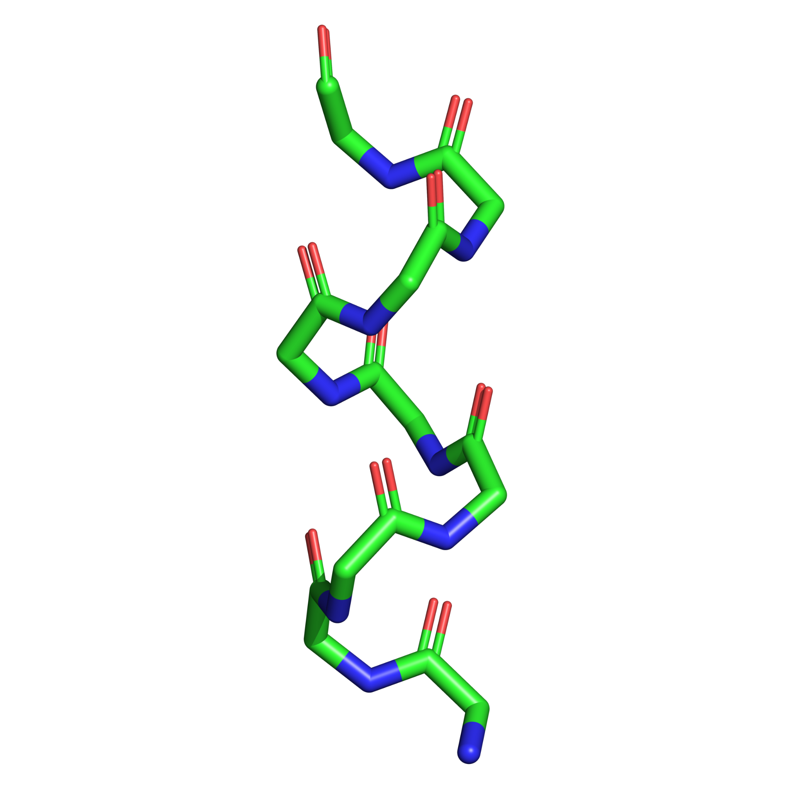
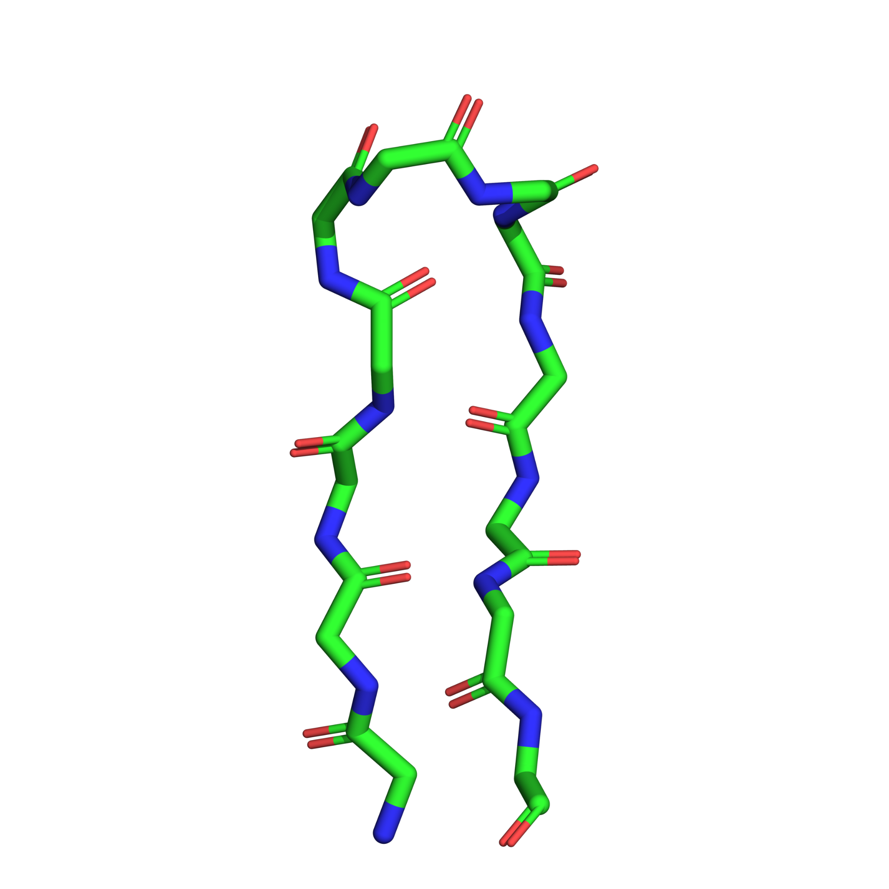

# Peptide Structure Generator from Ramachandran Angles

A C program for generating three-dimensional peptide backbone structures from prescribed Ramachandran dihedral angles $\phi$, $\psi$, and $\omega$.

The program constructs Cartesian coordinates for the backbone atoms **N, CA, C, and O** using fixed peptide-backbone bond lengths and bond angles together with recursive homogeneous transformation matrices. The generated coordinates are written to a PDB file.

Note: This code only generates only backbone atoms and does not generate side chains.
## Objective

The purpose of this program is straightforward:

```text
(φ, ψ, ω) angles
        |
        v
homogeneous-coordinate transformations
        |
        v
3D Cartesian backbone coordinates
        |
        v
output_structure.pdb
```

The supplied dihedral angles define the conformation that is generated. The program does not perform molecular dynamics, energy minimization, conformational optimization, or structural refinement.

## Features

- Generates a 3D peptide backbone from user-specified $\phi$, $\psi$, and $\omega$ angles.
- Constructs the backbone atoms N, CA, C, and O.
- Uses recursive 4 × 4 homogeneous transformation matrices.
- Uses fixed peptide-backbone bond lengths and bond angles.
- Accepts the angle-input filename from the command line.
- Writes the generated structure to `output_structure.pdb`.
- Includes alpha-helical and beta-hairpin examples.

## Repository structure

```text
peptide-structure-generator/
|-- README.md
|-- LICENSE
|-- CITATION.cff
|-- references.bib
|-- .gitignore
|-- src/
|   `-- proteinchain.c
`-- examples/
    |-- alpha_helix/
    |   |-- angles.txt
    |   |-- structure.pdb
    |   |-- structure_stick.png
    |   `-- structure_cartoon.png
    `-- beta_hairpin_2EVQ/
        |-- angles.txt
        |-- structure.pdb
        |-- structure_stick.png
        `-- structure_cartoon.png
```

## Compilation

With GCC:

```bash
gcc -Wall -Wextra src/proteinchain.c -o peptide_generator -lm
```

On Windows with GCC:

```powershell
gcc -Wall -Wextra src\proteinchain.c -o peptide_generator.exe -lm
```

## Usage

Linux/macOS:

```bash
./peptide_generator <input_angle_file>
```

Windows PowerShell:

```powershell
.\peptide_generator.exe <input_angle_file>
```

For example:

```powershell
.\peptide_generator.exe examples\alpha_helix\angles.txt
```

The generated structure is written to:

```text
output_structure.pdb
```

## Input format

The current program expects one angle per line, with a trailing comma. Every three consecutive values correspond to the $\phi$, $\psi$, and $\omega$ values of one residue.

Example:

```text
-57,
-47,
180,
-57,
-47,
180,
```

Angles are specified in degrees.

## Method and attribution

The local-frame forward-kinematics formulation used in this program is based on the Denavit-Hartenberg treatment described by **Hernan Stamati, Amarda Shehu, and Lydia Kavraki (2007)** in *Computing Forward Kinematics for Protein-like linear systems using Denavit-Hartenberg Local Frames*.

That work formulates a protein-like linear chain in internal coordinates (bond lengths, bond angles, and dihedral angles), attaches a local coordinate frame to each atom, and obtains Cartesian coordinates by recursively chaining homogeneous transformation matrices. The present code applies that geometric framework to peptide-backbone generation from prescribed Ramachandran angles.

Reference:

> H. Stamati, A. Shehu, and L. Kavraki, *Computing Forward Kinematics for Protein-like linear systems using Denavit-Hartenberg Local Frames*, Department of Computer Science, June 2007.

A BibTeX entry is provided in [`references.bib`](references.bib).

## Method

The peptide backbone is represented using fixed internal geometry. For each backbone step, the program combines the prescribed torsional angle with the corresponding fixed bond length and bond angle to construct a homogeneous transformation matrix.

These matrices are multiplied recursively so that each local backbone coordinate is mapped into a common Cartesian reference frame.

The final coordinates are written in PDB format as backbone heavy atoms:

```text
N - CA - C - O
```

## Examples

### Alpha-helical backbone

The alpha-helical example contains nine residues using repeated torsion values

$$
\phi=-57^\circ,\qquad
\psi=-47^\circ,\qquad
\omega=180^\circ.
$$



Input: [`examples/alpha_helix/angles.txt`](examples/alpha_helix/angles.txt)  
Generated PDB: [`examples/alpha_helix/structure.pdb`](examples/alpha_helix/structure.pdb)

### 2EVQ-derived beta-hairpin backbone

The second example uses backbone torsion angles extracted from Model 1 of PDB entry **2EVQ** to demonstrate generation of a non-idealized beta-hairpin-like backbone geometry.



Input: [`examples/beta_hairpin_2EVQ/angles.txt`](examples/beta_hairpin_2EVQ/angles.txt)  
Generated PDB: [`examples/beta_hairpin_2EVQ/structure.pdb`](examples/beta_hairpin_2EVQ/structure.pdb)

The present implementation uses idealized fixed backbone geometry and writes generic `ALA` residue labels. Therefore, the 2EVQ example demonstrates reconstruction of the backbone torsional pattern rather than an atom-for-atom reproduction of the deposited experimental structure.

## Current scope

The current implementation is intentionally focused on backbone generation:

- backbone heavy atoms N, CA, C, and O;
- fixed backbone bond lengths and bond angles;
- user-supplied backbone torsion angles;
- generic ALA residue labels in the PDB output;
- a fixed maximum number of residues determined by the arrays in the current implementation.

Side-chain construction, hydrogen placement, energy minimization, and molecular simulation are outside the scope of this version.

## Author

**Vigneshwaran Kannan**

## License

This project is released under the MIT License. See [`LICENSE`](LICENSE).
